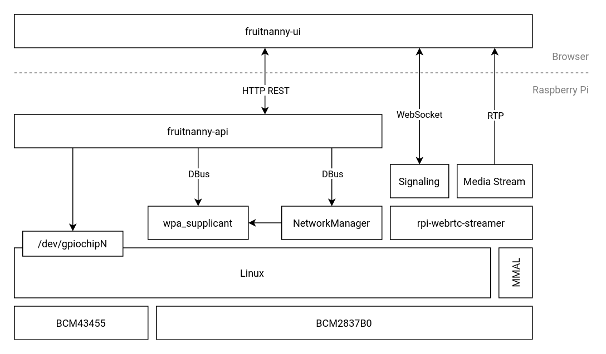

This section gives a quick overview about the FruitNanny software components
and their interaction.

[fruitnanny-ui](https://github.com/fruitnanny/fruitnanny-ui)
: The Web UI running in a browser on the client device. It exposes the WebRTC
  media stream from *rpi-webrtc-streamer* and controlling capabilities of the
  HTTP REST if *fruitnanny-api*.

[fruitnanny-api](https://github.com/fruitnanny/fruitnanny-api)
: Provides the static web server for the web UI and REST API.
  It controls WiFi networks via the DBus interface of NetworkManager.
  Available wireless networks are scanned via DBus interface of wpa_supplicant.
  The infrared light is controlled via GPIO. The new Linux GPIO char device ABI
  is used for that.

[rpi-webrtc-streamer](https://github.com/kclyu/rpi-webrtc-streamer/)
: Provides WebRTC capabilities based on the native WebRTC code. It provides a
  minimal signaling server via a WebSocket. The media stream is provided via
  RTP. The only supported codec is H.264. It uses the MMAL (Multi-Media
  Abstraction Layer) of the Raspberry Pi Broadcom VideoCore. This means the
  video stream is encoded with hardware support making it very efficient.

[NetworkManager](https://wiki.gnome.org/Projects/NetworkManager)
: FruitNanny uses NetworkManager instead the standard Raspbian
  [dhcpd(8)](https://linux.die.net/man/8/dhcpd). It exposes its functionality
  [via DBus](https://developer.gnome.org/NetworkManager/stable/spec.html).
