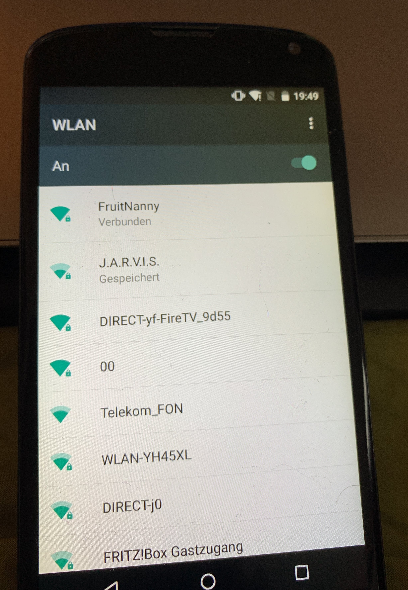

This section describes how to quickly start with the FruitNanny.

The FruitNanny is essentially a Raspberry Pi with a NoIR camera, microphone
and environmental sensor. It is accessed by a web UI via WiFi at
[fruitnanny.local](http://fruitnanny.local/). The web GUI provides
[WebRTC][webrtc]-based video streaming and WiFi controlling capabilities.

---

## Support Matrix

This is a list of platforms and browsers known to work. If your system is not
listed here, these are the required technologies:

1. [mDNS][mdns] support in order to resolve `*.local` domains in a local network
2. Browser with [WebRTC][webrtc] and [H.264](https://en.wikipedia.org/wiki/Advanced_Video_Coding)
   codec support for live video streaming.

<table>
	<thead>
		<tr>
			<th align="center">Supported</th>
			<th>Platform</th>
			<th>Browser</th>
			<th>Notes</th>
		</tr>
	</thead>
	<tbody>
		<tr>
			<td class="supported" align="center">✓</td>
			<td>Ubuntu</td>
			<td>Firefox, Chromium</td>
			<td><a href="https://www.avahi.org/">Avahi</a> for mDNS support.</td>
		</tr>
		<tr>
			<td class="supported" align="center">✓</td>
			<td>iOS</td>
			<td>Safari</td>
			<td></td>
		</tr>
		<tr>
			<td class="supported" align="center">✓</td>
			<td>Android</td>
			<td>Firefox Preview</td>
			<td>
				mDNS does not work on Android. Use IP address instead, see
				<a href="../network/#using-ip-addresses">this section</a>.
			</td>
		</tr>
		<tr>
			<td class="not-supported" align="center">✗</td>
			<td>Android</td>
			<td>Firefox</td>
			<td>
				Since version 68 Firefox for Android
				<a href="https://developer.mozilla.org/en-US/docs/Web/Media/Formats/WebRTC_codecs#Supported_video_codecs">no longer supports H.264</a>
				due to a <a href="https://support.mozilla.org/en-US/kb/firefox-android-openh264">change in Google Play policy</a>.
			</td>
		</tr>
		<tr>
			<td class="partially-supported" align="center">(?)</td>
			<td>Android</td>
			<td>Chrome</td>
			<td>
				On Android WebRTC, H.264 is supported only if:
				<ol>
					<li>
    					device hardware supports it <strong>and</strong>
					</li>
					<li>
    					WebRTC hardware encoder glue logic supports that
    					hardware encoder.
					</li>
					

						Currently only <em>Qualcomm</em> and <em>Exynos</em>
						devices are supported. Any other devices – even if they
						support H.264 hardware encoder – will not be used and
						will not be available for WebRTC streams.
					

					

						See <a href="https://groups.google.com/forum/#!msg/discuss-webrtc/xXjeKbW_JYI/LIXzVrKWCwAJ">here</a>
						for more information.
					

			</td>
		</tr>
		<tr>
			<td class="supported" align="center">✓</td>
			<td>Windows</td>
			<td>Chrome</td>
			<td>
				Chrome has <a href="https://developer.chrome.com/apps/mdns">built-in support</a>
				for mDNS.
			</td>
		</tr>
		<tr>
			<td class="not-supported" align="center">✗</td>
			<td>Windows</td>
			<td>Firefox</td>
			<td>
				Currently, Firefox does <a href="https://bugzilla.mozilla.org/show_bug.cgi?id=1239909">not support</a>
				the new mDNS API of in Windows 10.
			</td>
		</tr>
	</tbody>
</table>

## First Steps

### 1. Power

Connect the FruitNanny to a *5V microUSB power source*. A powerbank should
also do the trick and provides mobility. As soon as the FruitNanny is powered,
it will boot up.

### 2. Connect to WiFi Hotspot

If the FruitNanny does not find any known WiFi network, it starts its **WiFi
Hotspot**. Its default SSID is *FruitNanny*. Connect to the WiFi to get access
to the web UI.

### 3. Access Web UI

Once you are connected to the hotspot, the web UI can be accessed via
[http://fruitnanny.local/](http://fruitnanny.local/).

!!! note
	`.local` are [mDNS][mdns] domain names. The system and/or browser needs to
	support this technology. It is a well known issue that mDNS does not work
	properly on Android. Please consult the [support matrix](#support-matrix).

Hit the *Play* button and you should get a live video. If it is dark, just
turn on the infrared light.

Only **one device** can use the live stream at the same time. See
[this issue](https://github.com/kclyu/rpi-webrtc-streamer/issues/12) for
explanation.

If you want to connect the FruitNanny to your home network instead of using
the hotspot, please check the [network configuration section](../network/#connect-to-home-wlan).

### 4. Powering Off

The FruitNanny can be turned off via the main menu in the top left corner.

Of course, you could also just unplug the FruitNanny but this should be
avoided in order to properly shut down the operating system.

[mdns]: https://en.wikipedia.org/wiki/Multicast_DNS
[webrtc]: https://webrtc.org/
