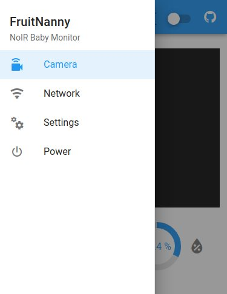

This section describes how to quickly start with the FruitNanny.

The FruitNanny is essentially a Raspberry Pi with a NoIR camera, microphone
and environmental sensor. The FruitNanny is accessed by a web UI via WiFi. The
web GUI provides [WebRTC][webrtc]-based video streaming and WiFi controlling
capabilities via [fruitnanny.local](http://fruitnanny.local/) [mDNS][mdns]
address.

---

## Support Matrix

This is a list of platforms and browsers known to work. If your system is not
listed here, these are the required technologies:

1. [mDNS][mdns] support in order to resolve `*.local` domains in a local network
2. Browser with [WebRTC][webrtc] support for live video streaming 

Platform | Browser | Notes 
-------- | ------- | ------
Ubuntu   | Firefox, Chromium |
iOS      | Safari  |
Android  | Firefox Preview | mDNS does not work on Android. Use IP address instead, see [this section](#using-ip-addresses).

## First Steps

### 1. Power

Connect the FruitNanny to a *5V microUSB power source*. A powerbank should
also do the trick and provides mobility. As soon as the FruitNanny is powered,
it will boot up.

### 2. Connect to WiFi Hotspot

If the FruitNanny does not find any known WiFi network, it starts its **WiFi
Hotspot**. Its default SSID is *FruitNanny*. Connect to the WiFi to get access
to the web UI.

### 3. Access Web UI

Once you are connected to the hotspot, the web UI can be accessed via
[http://fruitnanny.local/](http://fruitnanny.local/).

!!! note
	`.local` are [mDNS][mdns] domain names. The system and/or browser needs to
	support this technology. It is a well known issue that mDNS does not work
	properly on Android. Please consult the [support matrix](#support-matrix)

Hit the *Play* button and you should get a live video. If it is dark, just
turn on the infrared light.

Only **one device** can use the live stream at the same time.

### 4. Powering Off

The FruitNanny can be turned off via the main menu in the top left corner.

Of course, you could also just unplug the FruitNanny but this should be
avoided in order to properly shut down the operating system.

## Connect to Home WLAN

The accessing device only needs to be in the same local network as the
FruitNanny in order to use the web UI. This meas if the FruitNanny is later
connected to the local home WLAN, the web UI can accessed from any device in
the home network.

1. Select *Network* via the app main menu in the top left corner.
2. Go to the *WLAN* tab and select the network of choice.
3. You will be prompted for the password.
4. Connect your device to the **same WLAN** and go back to your browser within
   **60 seconds**. Wait for the connection to be established. 

!!! note
	FruitNanny implements a safety mechanism to avoid you locking yourself out of
	your FruitNanny when changing network settings. A checkpoint is created
	before any change in network configuration is performed. This checkpoint will
	automatically rollback any change after 60 seconds. This means, if you have
	messed up the your configuration, do not worry, your FruitNanny will be back
	after one minute.  

	The web UI will try to clear the checkpoint. This is only successful if your
	device is able to connect to the FruitNanny after the network settings were
	changed.

## Installing Updates

If the FruitNanny has connection the Internet, it can check and install
updates via the web UI.

You can check for updates:

1. Go to *Settings* via app main menu in the top left corner
2. Go to the *System* tab 
3. Hit *Check for Updates* button.

If updates are available, you will see a download icon in the top right
corner.

Clicking on this icon will install available updates for all
FruitNanny-related system packages.

## Using IP Addresses

!!! todo
	This section will describe how to use the FruitNanny in case mDNS is not
	available.

[mdns]: https://en.wikipedia.org/wiki/Multicast_DNS
[webrtc]: https://webrtc.org/